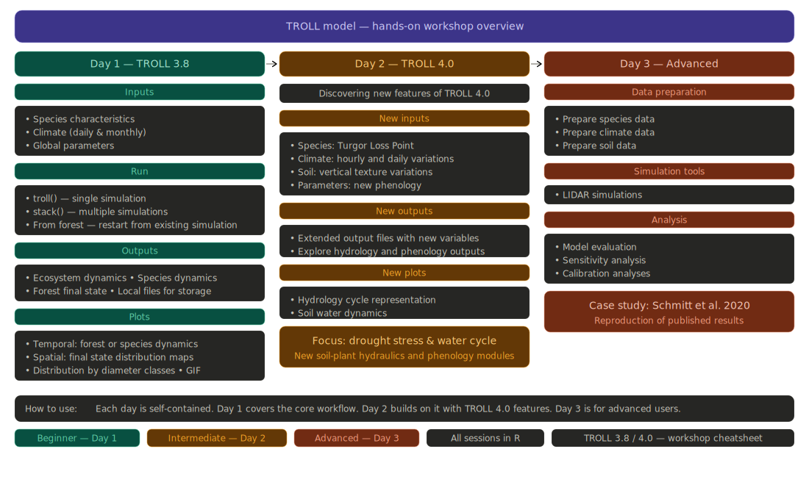

## Menu

```{r}
#| echo: false

```

# Introduction

<!-- New features -->

# Inputs - Species

# Inputs - Climate

# Inputs - Soil

# Inputs - Parameters

# Outputs - Files

# Outputs - Water balance

# Outputs - Soil water

# References
